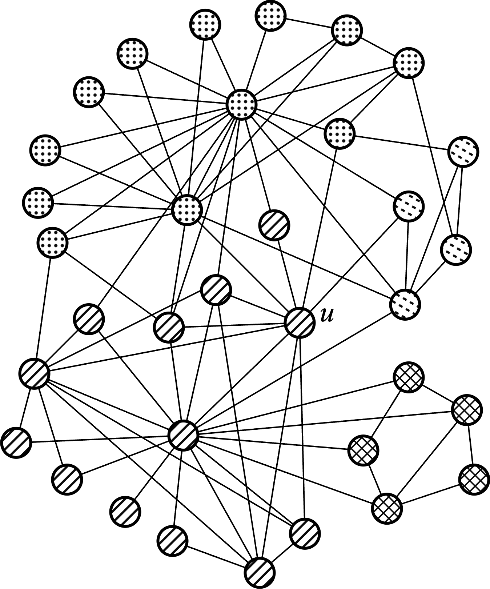
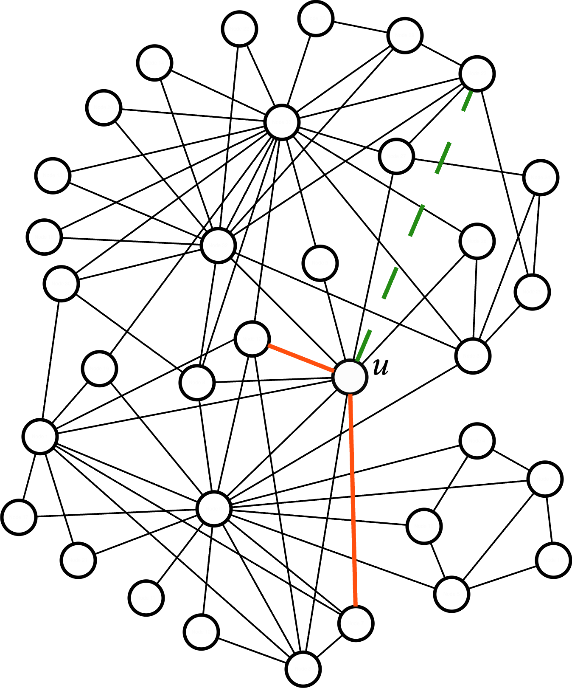
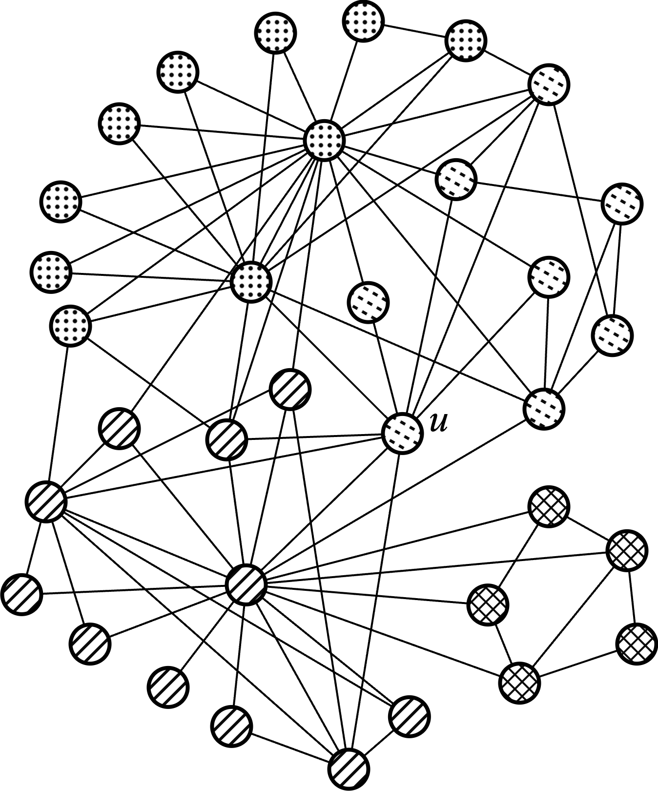

# Community Membership Hiding 

<p align="center">
  
  
  
</p>

## Requirements

Make sure to have conda installed, then run:

```bash
conda conda create --name socialnets --python=3.9.18
conda activate socialnets
```

Python 3.9 is required, as the package `karateclub` is based on old dependencies.

Then, install the requirements:

```bash
pip install -r requirements.txt
```

```bash
# Optional dependencies
pip install pyg_lib torch_scatter torch_sparse -f <https://data.pyg.org/whl/torch-${TORCH}.html>
```


## Run the code

To execute the experiments, run the following command:

```bash
python main.py 
```


## Directory Structure

```bash
├── dataset
│   ├── data                                # Contains the datasets
│   │   └── ...
│   └── readme.md
├── images                                  
│   └── ...
├── notebook                                # Contains the notebooks used for the analysis
│   └── ...                                                    
├── src                                     # Contains the source code
│   ├── agent
│   │   ├── a2c                             # Contains the agent code
│   │   │   ├── a2c.py
│   │   │   ├── actor.py
│   │   │   ├── critic.py
│   │   │   ├── __init__.py
│   │   │   └── readme.md
│   │   ├── agent.py
│   │   ├── __init__.py
│   │   └── readme.md
│   ├── community_algs                      # Contains algorithms for community analysis
│   │   ├── baselines
│   │   │   ├── community_hiding            # Community Deception algorithms
│   │   │   │   ├── __init__.py
│   │   │   │   ├── modularity.py
│   │   │   │   ├── modularity_test.py
│   │   │   │   ├── permanence.py
│   │   │   │   ├── safeness.py
│   │   │   │   └── safeness_tets.py
│   │   │   ├── node_hiding                 # Community Membership Hiding algorithms
│   │   │   │   ├── degree_hiding.py
│   │   │   │   ├── __init__.py
│   │   │   │   ├── random_hiding.py
│   │   │   │   └── roam_hiding.py
│   │   │   ├── __init__.py
│   │   │   └── readme.md
│   │   ├── dcmh                            #contains the implementation of nabla-CMH
│   │   │   ├── conf
│   │   │   │   └── base.yaml
│   │   │   └── dcmh_hiding.py
│   │   ├── metrics                         # Contains an implementation of the metrics used for the evaluation
│   │   │   ├── deception_score.py
│   │   │   ├── nmi.py
│   │   │   ├── readme.md
│   │   │   └── similarity.py
│   │   ├── detection_algs.py               # Contains the community detection algorithms
│   │   ├── __init__.py
│   │   └── readme.md
│   ├── environment                         # Contains the environment of the agent
│   │   ├── graph_env.py
│   │   ├── __init__.py
│   │   └── readme.md
│   ├── models                              # Contains the trained models
│   │   └── ...
│   ├── utils                               # Contains utility functions
│   │   ├── hiding_community.py
│   │   ├── hiding_node.py
│   │   ├── __init__.py
│   │   ├── readme.md
│   │   └── utils.py
│   └── __init__.py
├── outputs                                    # Contains the outputs of the test
│   └── ...
├── main.py
├── README.md
└── requirements.txt
```
